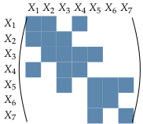

---

# .small[Background on Gaussian Graphical Models]
  
Suppose $\mathbf{Z} \sim \mathcal{N}(\mathbf{0}, {\boldsymbol\Omega}^{-1}=\boldsymbol\Sigma)$
  
### Conditional independence structure

  $$(i,j)  \notin  \mathcal{E}  \Leftrightarrow  Z_j  \perp  Z_k  | Z_{\backslash \{j,k\}} \Leftrightarrow {\boldsymbol\Omega}_{jk} = 0.$$

.pull-left[
  $\mathcal{G}=(\mathcal{P},\mathcal{E})$
]

.pull-right[
  $\boldsymbol\Omega$
  ]

### Graphical-Lasso

Network reconstruction is (roughly) a variable selection problem
$$\hat{{\boldsymbol\Omega}}_\lambda=\arg\max_{\boldsymbol\Omega     \in     \mathbb{S}_+}
      \ell({\boldsymbol\Omega};\mathbf{Y})-\lambda \|{\boldsymbol\Omega}\|_{1}$$

---

# Sparse precision for multivariate counts

The PLN-network model add a sparsity constraint on the precision matrix ${\boldsymbol\Sigma}^{-1}\triangleq \boldsymbol\Omega$:

$$\begin{array}{rcl}
  \text{latent space } &   \mathbf{Z}_i \sim \mathcal{N}\left({\mathbf{o}_i + \mathbf{x}_i^\top\boldsymbol\Theta},\boldsymbol\Omega^{-1}\right) &  \|\boldsymbol\Omega\|_1 < c \\
    \text{observation space } &  \mathbf{Y}_i | \mathbf{Z}_i \sim \mathcal{P}\left(\exp\{\mathbf{Z}_i\}\right)
  \end{array}$$


$\rightsquigarrow$ The $\ell_1$-penalty induces selection of direct relations (an underlying network)

## .small[Variational approximation]
  
$$J(\theta, q)  - \lambda  \| \boldsymbol\Omega\|_{1,\text{off}} = \mathbb{E}_{q} [\log p_\theta(\mathbf{Y}, \mathbf{Z})] + \mathcal{H}[q(\mathbf{Z})] - \lambda  \|\boldsymbol\Omega\|_{1, \text{off}}$$

Still bi-concave in $(\boldsymbol\Omega, \boldsymbol\Theta)$ and $(\mathbf{M}, \mathbf{S})$.  

Solving in  $\boldsymbol\Omega$ leads to

$$\hat{\boldsymbol\Omega} = \arg\max_{\boldsymbol\Omega} \frac{n}{2} \left(\log | \boldsymbol\Omega | - \text{trace}(\hat{\boldsymbol\Sigma} \boldsymbol\Omega)\right) - \lambda \|\boldsymbol\Omega\|_{1, \text{off}}: \quad \text{graphical-Lasso problem}$$
with $\hat{\boldsymbol\Sigma} = n^{-1}(\mathbf{M}^\top \mathbf{M} + \mathrm{diag}(\bar{\mathbf{S}}^2)$.

---
# Network inference on the oaks data set

- Infer a collections of networks indexed by the sparsity accounting for the tree effect.

$$\text{EBIC}_\gamma(\hat{\boldsymbol\Omega}_\lambda)  =   -2 \textrm{loglik} (\hat{\boldsymbol\Omega}) + \log(n) (|\mathcal{E}_\lambda| + p d) + \gamma \log {p(p+1)/2 \choose |\mathcal{E}_\lambda|},$$
       
.pull-left[
where $\mathcal{E}_\lambda$ is the number of selected edge at $\lambda$.

<br />
```{r PLNnetwork tree, cache = TRUE, results = FALSE}
networks_oaks_tree <- 
  PLNnetwork(
    Abundance ~ 0 + tree + 
           offset(log(Offset)),
    data = oaks
  )
```

]

.pull-right[
```{r plot network family site, fig.width = 6, fig.height = 6, echo = FALSE, caption = "with tree correction"}
plot(networks_oaks_tree)
```
]

---
# PLNnetwork: field access

Let us plot the estimated correlation matrix, after regularization of its inverse, and the corresponding network of partial correlation.

.pull-left[
```{r plot network site, fig.width = 7, fig.height = 7, caption = "with site correction", echo = FALSE}
net2 <- getBestModel(networks_oaks_tree)
corrplot(cov2cor(sigma(net2)), cl.pos = "n",
  is.corr = FALSE, method = 'color')
```
]

.pull-right[
```{r plot net site, fig.width = 8, fig.height = 8, caption = "with site correction", echo = FALSE}
plot(net2)
```
]

---
# PLNnetwork: stability selection

An alternative to model selection criteria is the stability selection  - or StARS in the context of network.

1. Infers $B$ networks ${\boldsymbol\Omega}^{(b, \lambda)}$ on subsamples of size $m$ for varying $\lambda$.

2. Frequency of inclusion of each edges $e = i\sim j$ is estimated by $$p_e^\lambda = \# \{b: \Omega^{(b, \lambda)}_{ij} \neq 0\}/B$$

3. Variance of inclusion of edge $e$ is $v_e^\lambda = p_e^\lambda (1 - p_e^\lambda)$. 

4. Network stability is $\textrm{stab}(\lambda) = 1 - 2\bar{v}^\lambda$ where $\bar{v}^\lambda$ is the average of the $v_e^\lambda$. 

<br />

$\rightsquigarrow$ StARS<sup>1</sup>  selects the smallest $\lambda$ (densest network) for which $\textrm{stab}(\lambda) \geq 1 - 2\beta$

.footnote[`r Citet(myBib, "stars")` suggest using $2\beta = 0.05$ and $m = \lfloor 10 \sqrt{n}\rfloor$ based on theoretical results.]

---
# StARS

In `getBestModel`, when "StARS" is requested, stabilitiy selection is performed if needed:

```{r stability selection fake, eval = FALSE}

stability_selection(networks_oaks_tree, mc.cores = 10)
```

```{r stability selection, cache = TRUE, echo = FALSE, results='hide'}
networks_oaks_tree <- 
  PLNnetwork(
    Abundance ~ 0 + tree + 
           offset(log(Offset)),
    data = oaks
  )
stability_selection(networks_oaks_tree, mc.cores = 10)
```


.pull-left[
```{r plot network stars, fig.width = 7, fig.height = 7, caption = "stability path", echo = FALSE}
plot(networks_oaks_tree, "stability", stability = 0.985)
```
]

.pull-right[
```{r plot net stars, fig.width = 8, fig.height = 8, caption = "with site correction", echo = FALSE}
p2 <- plot(getBestModel(networks_oaks_tree, "StARS", stability = .985))
```
]
