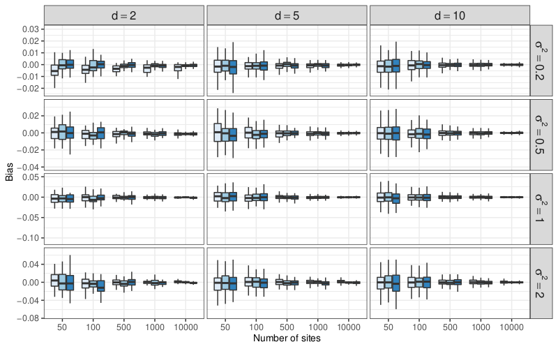
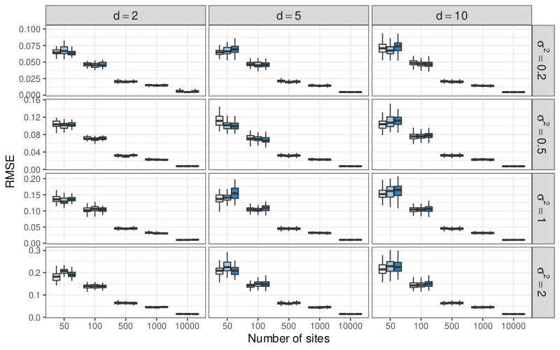
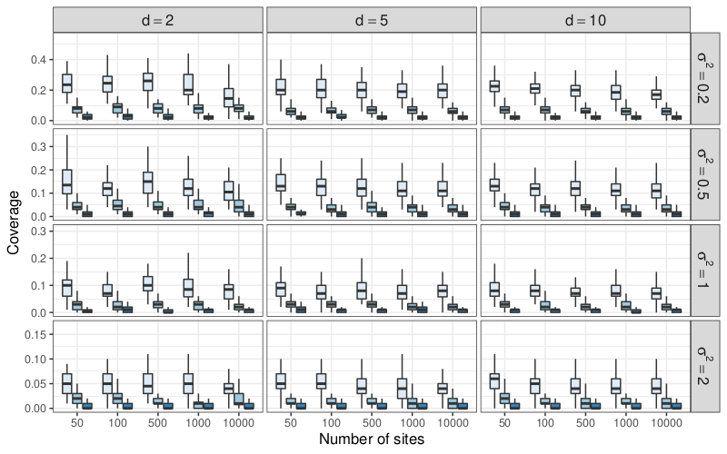

---

# Models for multivariate count data

## If we were in a Gaussian world...

The .important[general linear model] `r Citep(myBib, "MKB79")` would be appropriate! For each sample $i = 1,\dots,n$, 

$$\underbrace{\mathbf{Y}_i}_{\text{abundances}} =  \underbrace{\mathbf{x}_i^\top \boldsymbol\Theta}_{\text{covariates}} + \underbrace{\mathbf{o}_i}_{\text{sampling effort}} + \boldsymbol\varepsilon_i, \quad \boldsymbol\varepsilon_i \sim \mathcal{N}(\mathbf{0}_p, \underbrace{\boldsymbol\Sigma}_{\text{between-species dependencies}})$$

null covariance $\Leftrightarrow$ independence $\rightsquigarrow$ uncorrelated species/transcripts do not interact

$\rightsquigarrow$ This model gives birth to Principal Component Analysis,  Discriminant Analysis, Gaussian Graphical Models, Gaussian Mixture models and many others $\dots$


## With count data...

There is no generic model for multivariate counts

  - Data transformation (log, $\sqrt{}$) : quick and dirty
  - Non-Gaussian multivariate distributions `r Citep(myBib, "IYA16")`: do not scale to data dimension yet
  - .important[Latent variable models]: interaction occur in a latent (unobserved) layer

---

# The Poisson Lognormal model (PLN)

The PLN model `r Citep(myBib, "AiH89")` is a .important[multivariate generalized linear model], where 

- the counts $\mathbf{Y}_i$ are the response variables
- the main effect is due to a linear combination of the covariates $\mathbf{x}_i$
- a vector of offsets $\mathbf{o}_i$ can be specified for each sample.

$$
\mathbf{Y}_i | \mathbf{Z}_i \sim \mathcal{P}\left(\exp\{\mathbf{Z}_i\}\right), \qquad \mathbf{Z}_i \sim \mathcal{N}({\mathbf{o}_i + \mathbf{x}_i^\top\boldsymbol\Theta},\boldsymbol\Sigma), \\
$$

.pull-left[The unkwown parameters are 
- $\boldsymbol\Theta$, the regression parameters
- $\boldsymbol\Sigma$, the variance-covariance matrix
]

.pull-right[
PLN has some expected properties
- over-dispersion
- covariance with arbitrary signs
]


When all individuals $i=1,\dots,n$ are together, the data matrices required are
  - the $n\times p$ matrix of counts  $\mathbf{Y}$
  - the $n\times d$ matrix of design  $\mathbf{X}$
  - the $n\times p$ matrix of offsets $\mathbf{O}$

---
# Geometrical view

```{r PLN geometry, echo=FALSE, message=FALSE, fig.width=12, fig.height=8}
library(gridExtra)
set.seed(20171110)
x <- rnorm(100)
y <- rnorm(100)
b <- data.frame(x = x + y, y = y) / 1
mu <- 0
##
data.perfect <- as.data.frame((b + matrix(rep(mu, each = length(x)), ncol = 2)))
p.latent <- ggplot(data.perfect, aes(x, y)) + geom_point() + ggtitle(expression(Latent~Space~(Z)))
.rpois <- function(lambda) {
  unlist(lapply(exp(lambda), function(x) {rpois(1, x)}))
}
observation <- as.data.frame(lapply(data.perfect, .rpois))
mapped.parameter <- as.data.frame(lapply(data.perfect, exp))
## segment between mapped and observed data
segment.data <- cbind(mapped.parameter, observation)
names(segment.data) <- c("x", "y", "xend", "yend")
## Mapped parameters
p.mapped <- ggplot(mapped.parameter, aes(x, y)) + geom_point(col = "red") + ggtitle(expression(Observation~Space~(exp(Z))))
## Observations only
obs <- group_by(observation, x, y)
obs <- dplyr::summarize(obs, count = n())
p.observation.only <- ggplot(obs, aes(x, y)) +
  geom_point(aes(size = count)) +
  ggtitle(Observation~Space~(Y)~+'noise') +
  theme(legend.position = c(.95, .95), legend.justification = c(1, 1),
        legend.background = element_rect(color = "transparent"),
        legend.box.background = element_blank())
## Observations and latent parameters
p.observation.mixed <- p.observation.only +
  geom_point(data = mapped.parameter, color = "red", alpha = 0.5) +
  geom_segment(data = segment.data, aes(xend = xend, yend = yend), color = "black", alpha = 0.2) +
  ggtitle(Observation~Space~(Y==P(exp(Z)))~+'noise')
  grid.arrange(p.latent + labs(x = "species 1", y = "species 2"),
               p.mapped  + labs(x = "species 1", y = "species 2"),
               p.observation.mixed + labs(x = "species 1", y = "species 2"),
               p.observation.only + labs(x = "species 1", y = "species 2"),
               ncol = 2)
```

---
# .small[Inference: latent model but intractable EM]
  
## Aim of the inference

  - estimate $\theta = (\boldsymbol\Theta, \boldsymbol\Sigma)$ 
  - predict the $\mathbf{Z}_i$

## Maximum likelihood

PLN is an incomplete data model: try EM
$$\log p_\theta(\mathbf{Y}) = \mathbb{E}_p [\log p_\theta(\mathbf{Y}, \mathbf{Z}) \,|\, \mathbf{Y}] + \mathcal{H}[p_\theta(\mathbf{Z}\,|\,\mathbf{Y})]$$ 

EM requires to evaluate (some moments of) $p_\theta(\mathbf{Z} \,|\,  \mathbf{Y})$, but there is no close form!

## Solutions

  - `r Citep(myBib, "AiH89")` resort on numerical integration; `r Citep(myBib, "Kar05")` Monte-Carlo integration
  - Several heuristics, not always well motivated, found in the literature...
  - .important[Variational approach] `r Citep(myBib, "WaJ08")`: use a proxy of $p_\theta(\mathbf{Z}\,|\,\mathbf{Y})$.

---
# Variational approach: principle

.important[See the outstanding Stéphane Robin's Lecture]

## Idea

  - Find a proxy of the conditional distribution $p(\mathbf{Z}\,|\,\mathbf{Y})$:

$$q(\mathbf{Z}) \approx p_\theta(\mathbf{Z} | \mathbf{Y}).$$
  - Choose a convenient class of distribution $\mathcal{Q}$ and minimize a divergence

$$q(\mathbf{Z})^\star  \arg\min_{q\in\mathcal{Q}} D\left(q(\mathbf{Z}), p(\mathbf{Z} | \mathbf{Y})\right).$$

## Popular choice

The Küllback-Leibler divergence .small[(error averaged wrt the approximated distribution)]

$$KL\left(q(\mathbf{Z}), p(\mathbf{Z} | \mathbf{Y})\right) = \mathbb{E}_q\left[\log \frac{q(z)}{p(z)}\right] = \int_{\mathcal{Z}} q(z) \log \frac{q(z)}{p(z)} \mathrm{d}z.$$

---
# Variational approach: PLN

## Class of distribution: diagonal multivariate Gaussian

$$\mathcal{Q} = \Big\{q: \quad q(\mathbf{Z}) = \prod_i q_i(\mathbf{Z}_i), \quad q_i(\mathbf{Z}_i) = \mathcal{N}(\mathbf{Z}_i; \mathbf{m}_i, \mathbf{s}_i \circ \mathbf{s}_i) \Big\}$$

Maximize the ELBO (Evidence Lower BOund):

$$J(\theta, q) = \log p_\theta(\mathbf{Y}) - KL[q_\theta (\mathbf{Z}) ||  p_\theta(\mathbf{Z} | \mathbf{Y})]  = \mathbb{E}_{q} [\log p_\theta(\mathbf{Y}, \mathbf{Z})] + \mathcal{H}[q(\mathbf{Z})]$$

## Variational EM

  - VE step: find the optimal $q$ (here, $\{(\mathbf{m}_i, \mathbf{s}_i)\}_{i=1,\dots,n} = \{\mathbf{M}, \mathbf{S}\}$): 
$$q^h = \arg \max J(\theta^h, q) = \arg\min_{q \in \mathcal{Q}} KL[q(\mathbf{Z}) \,||\, p_{\theta^h}(\mathbf{Z}\,|\,\mathbf{Y})]$$
  - M step: update $\hat{\theta}^h$
$$\theta^h = \arg\max J(\theta, q^h) = \arg\max_{\theta} \mathbb{E}_{q} [\log p_{\theta}(\mathbf{Y}, \mathbf{Z})]$$

---
# .small[Application to the optimization of PLN models]
  
## Property of PLN variational approximation

The ELBO $J(\theta, q)$ is bi-concave, i.e.
  - concave wrt $q = (\mathbf{M}, \mathbf{S})$ for given $\theta$ 
  - convace wrt $\theta = (\boldsymbol\Sigma, \boldsymbol\Theta)$ for given $q$ 
but .important[not jointly concave] in general.

## Optimization

Gradient ascent for the complete set of parameters<sup>1</sup> $(\mathbf{M}, \mathbf{S}, \boldsymbol\Sigma, \boldsymbol\Theta)$

  - **algorithm**: conservative convex separable approximations `r Citet(myBib, "Svan02")` <br/>
  - **implementation**: `NLopt` nonlinear-optimization library `r Citet(myBib, "nlopt")` <br/>
  - **initialization**: LM after log-trasnformation applied independently on each variables + concatenation of the regression coefficients + Pearson residuals

.footnote[[1] Alternating between variational and model parameters is useless here <br/>
          [2] Optimizing on $\mathbf{S}$ such as $\mathbf{S} \circ \mathbf{S} = \mathbf{S}^2$ is the variance avoids positive constraints ]

---
# Properties of the variational estimators

.important[VEM stationary point is not a log-likelihood stationary point]

## Simulations settings

- number of samples $n \in \{50, 100, 500, 1000, 10000\}$
- number of species/genes $p \in \{20, 200\}$
- number of covariates $d \in \{2, 5, 10\}$
- sampling effort $TSS \in \{\text{low}, \text{medium}, \text{high}\}$ ($\approx 10^4$, $10^5$ and $10^6$)
- noise level $\sigma^2 \in \{0.2, 0.5, 1, 2\}$
- $\boldsymbol\Sigma$ as $\sigma_{jk} = \sigma^2 \rho^{|j-k|}$, with $\rho = 0.2$
- $\mathbf{\Theta}$ with entries sampled from $\mathcal{N}(0,1/d)$

## Striking conclusion

- asymptotically .important[unbiased]
- variance (using naïve approach with Hessian-based Fisher information matrix) .important[underestimated]

$\rightsquigarrow$ No trusted confidence intervals can be easily derived with this approach

---

# Bias



---

# Root mean square error


---

# Coverage


