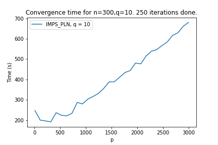
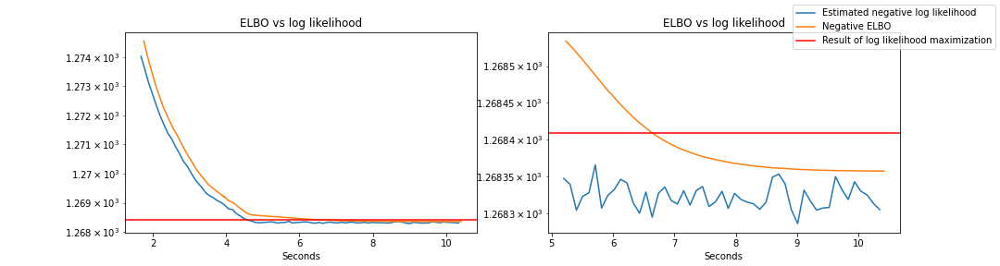

```{r setup, include=FALSE, warning=FALSE, message=FALSE}
options(htmltools.dir.version = FALSE)
knitr::opts_chunk$set(fig.align='center')
library(tidyverse) # data manipulation
library(reticulate)
use_condaenv("pyPLNmodels")
```

```{r, load_refs, echo=FALSE, cache=FALSE, message=FALSE, warning=FALSE}
library(RefManageR)
BibOptions(check.entries = FALSE, 
           bib.style = "authoryear", 
           cite.style = 'alphabetic', 
           style = "markdown",
           hyperlink = FALSE, 
           dashed = FALSE)
myBib <- ReadBib("./optimPLN.bib", check = FALSE)
```

# PLN Google Search

### Github group


---
# PLN Google Search

### Mind the Spelling!


# Poisson lognormal Model

.pull-left2[
Let

<br/>

We observe

]

.pull-right2[
- $n$ be the number of sites/cells/samples
- $p$ the number of species/genes/variables
- $d$ the number of environmental covariates
- $n$ measures of the joint counts $Y_i\in\mathbb{N}^p$
- $n$ measures of the environment covariates matrix $X_i\in\mathbb{R}^d$
]

$$\begin{aligned}
Z_{i} &= \beta^{\top} X_i + CW_i, \qquad W_{i} \sim \mathcal{N}\left(0, I_{q}\right) \\[1.25ex]
Y_{i j}  \mid Z_{i j} & \sim \mathcal{P}\left(\exp \left( Z_{i j}\right)\right) \\
\end{aligned}$$

where $q\leq p$ is the dimension of the latent space. The model parameters encompass

  - The matrix of regression parameters $\beta = (\beta _{kj})_{1 \leq k \leq d, 1 \leq j \leq p}$,
  - The matrix $C \in \mathbb R^{p\times q}$ sending the latent variable $W_i$ from $\mathbb{R}^q$ to $\mathbb{R}^p$.

If $p = q$, $\theta = (\beta, \Sigma = C^T C)$, .important[standard PLN], see `r Citep(myBib, c("PLN", "PLNmodels"))`

If $q < p$, $\theta = (\beta, C)$, .important[PLN-PCA], see `r Citep(myBib, "PLNPCA")`

---

# .small[Example for visualization of single-cell data]

A dataset containing the counts of the 500 most varying transcripts in the mixtures of 5 cell lines in human liver, for a total of 3918 cells

```{r, echo = FALSE, message= FALSE, cache = TRUE, results='hide'}
library(ZIPLN)
library(PLNmodels)
data(scRNA)
scRNAsub        <- scRNA[sample.int(nrow(scRNA), 500), ]
scRNAsub$counts <- scRNAsub$counts[, 1:200]
scRNAsub$counts %>% as_tibble() %>% rmarkdown::paged_table()
myPLN <- PLN(counts ~ 1 + offset(log(total_counts)), data = scRNAsub,control = list(trace = 0))
```

```{r, echo = FALSE, out.width='50%'}
prcomp(myPLN$latent) %>% factoextra::fviz_pca_ind(axes = c(1,2), col.ind = scRNAsub$cell_line)
```

$\rightsquigarrow$ `R` implementation with V-EM and standard non linear optimization techniques works up to hundreds of variables and thousands of samples. Can we do better? .important[ML + Pytorch] `r Citep(myBib, "Pytorch")`

---

# Inference

We wish to solve $\hat{\theta} = \arg\max _{\theta} \sum _{i =1} ^n \log p_{\theta}(Y_i)$

### .content-box-red[.small[Approximated Expectation-Maximization (Variational EM), `r Citep(myBib, c("VEM", "PLNPCA"))`]]

.content-box-yellow[

$$\arg\max_{\theta, \, q\in\mathcal{Q}} \; \sum_{i=1}^n J_i(\theta, \psi_i) = \sum_{i=1}^n \log p_{\theta}(Y_i)-K L\left[q(W_i) \|  p_{\theta}(W_i \mid Y_i)\right]$$

where $J_i(\theta, \psi) = \mathbb{E}_{q_i ;\theta^{t}}\left[\log p_{\theta}(Y_i, W_i) \mid Y_i\right] - \mathbb{E}_{q_i ;\theta^{t}} [\log q_i(W_i;\psi_i)]$

and $q_i(.; \psi_i) \in \mathcal{Q} = \{ \mathcal{N}\left(M_{i}, \operatorname{diag} (S_{i}\odot S_i )), M_i \in \mathbb{M} ^q, S_i \in \mathbb{R}^q\right\}$
]

--

### .content-box-red[.small[Direct optimization by approximating the gradient of the objective]]

.content-box-yellow[

$$\nabla_{\theta} \sum _{i =1} ^n \log p_{\theta}(Y_i) = \sum _{i =1} ^n \nabla_{\theta}  \log \left(  \int_{R^q} p_{\theta} (Y_i|W_i) p(W_i)\mathrm{d} W_i \right)$$
- Ingredient 1: Stochastic-gradient method with variance reduction
- Ingredient 2: Monte-Carlo estimation and importance sampling + Pytorch
]

---

# 1. Variational EM

### PLN

$$Y_{i}  \mid Z_{i} \sim \mathcal{P}\left(\exp \left( Z_{i}\right)\right), Z_{i} \sim\mathcal{N}(\beta^{\top} X_i, \Sigma)$$

- M step is explicit : for fix $\psi_i = (M_i,S _i)$, then

$$\hat{\Sigma} = \frac{1}{n} \sum_{i}\left(\left((M^{(t)}-X\beta)_{i} (M^{(t)}-X\beta)_{i}\right)^{\top}+S^{(t)}_{i}\right), \quad\hat{\beta} = (X^{\top}X)^{-1}X^{\top}M^{(t)}$$

- E-step: for fix $\theta$ to $\hat{\theta}$, solve in $\psi_i$ by gradient ascent

### PLN-PCA

Joint gradient ascent on $(\theta, \psi) = (C, \beta, {M_i, S_i, i=1,\dots,n})$

### Tuning

- Use Rprop `r Citep(myBib, "RPROP")` to solve the gradient ascent
  - SGD with momentum/adaptive learning rate
  - Use the sign of the gradient + one learning rate per parameter

---

# Performance of V-EM

```{r, out.width='60%', echo=FALSE, fig.cap="Running times for $n=1000, q=10, d=1$."}
knitr::include_graphics("Comparison_fastPLN_vs_fastPLNPCA_n=1000.png")
```

.pull-left2[
PLN

PLN-PCA

]

.pull-right2[
- convergence in a small number of iterations
- $\mathcal{O}(n p + p^2)$ parameters to optimize + inversion of $\hat{\Sigma} (p\times p)$
- convergence for a large number of iterations,
- $\mathcal{O}(n p + p q)$ parameters to optimize + inversion of $\hat{\Sigma} (q\times q)$
]

---

# 2. Direct Gradient approx: .small[first ingredient]

Optimize a ( $\mu$-strongly) convex function $f(\theta) = \sum_{i} f_i(\theta)$, $L$-gradient Lipschitz.

#### Stochastic Gradient Descent (SGD)

$$\begin{aligned}
\text{For } & t=1,\dots,T \\
& i_t\sim\mathcal{U}([1,..,n]) \\
& \theta_{t+1} \leftarrow \theta - \eta \nabla f_{i_t}(\theta_t)\\
\end{aligned}$$

--

#### SGD with Variance Reduction (SAGA, `r Citep(myBib, "SAGA")`)

$$\begin{aligned}
\text{For } & t=1,\dots,T \\
& i_t\sim\mathcal{U}([1,..,n])\\
& \theta_{t+1} \leftarrow \theta - \eta \left(\nabla f_{i_t}(\theta_t) - \nabla f_{i_t}(\alpha^t_{i_t}) + \frac{1}{n} \sum_{i=1}^n \nabla f_i (\alpha_i^t) \right) \\
& \text{For } i=1,\dots,n \\
& \quad \alpha_i^{t+1} \leftarrow \mathbf{1}_{\{i_t = i\}} \theta_t + \mathbf{1}_{\{i_t \neq i\}} \alpha_i^t \\
\end{aligned}$$

- stabilize the estimation of the gradient by averaging
- need to store all the gradients
- other variants (SVRG, `r Citep(myBib, "SVRG")`)

---

# 2. Direct Gradient approx: .small[second ingredient]

In our average SGD algorithm, we need to estimate $\nabla_{\theta} \log p_{\theta}(Y_i) = \mathbb{E}_{W} \left[p_\theta(Y_i|W) \right]$.

Let $\tilde p_{\theta} = p_{\theta}(Y_i| W_i) p(W_i)$ (explicit) and $n_s$ the sampling effort. MC approach solves

$$p_{\theta}(Y_i) = \int \tilde p_{\theta}(W_i) \mathrm dW_i \approx \frac 1 {n_s} \sum_{k=1}^{n_s} \tilde p_{\theta}, \text{ where } W_i \sim\mathcal{N}(0,I_q)$$
$\rightsquigarrow$ $\tilde p_{\theta}$ has little mass near zero, huge variance, poor approximation.

--

### Importance Sampling

Consider a density function $\phi$ (the importance law). Importance sampling relies on

$$\mathbb{E}_{W} \left[p_\theta(Y_i|W) \right] = \mathbb{E}_\phi \left[ \frac{p_\theta(Y_i|W) p(W)}{\phi(W)}\right].$$
To estimate $p_\theta$ as follows:

$$p_{\theta}(Y_i) = \int \tilde p_{\theta}(W) \mathrm dW \approx \frac 1 {n_s} \sum_{k=1}^{n_s} \frac {\tilde p_{\theta}(V_k)}{\phi(V_k)}, \quad (V_{k})_{1 \leq k \leq n_s} \overset{iid}{\sim} \phi(.)$$

---

# Choice of the importance law

### Optimal choice

The IS estimator is consistent, with variance depending on $\phi$. The optimal choice is such as

$$\phi_{opt}(V_i) = \frac{\tilde{p}_{\theta}(V_i)}{p_\theta(Y_i)} = p(V_i|Y_i)$$
--

### Practical choice

We chose $\phi(V) \sim \mathcal{N}(\mu, \Sigma)$ with  

$$\hat{\mu} = \arg\max_\mu \log p(W_i|Y_i) = \arg\max_\mu \log \tilde{p}(W_i)$$
that we solve numerically (thank you Pytorch).

For the Covariance,

$$\hat{\Sigma}^{-1} = \frac{\partial^2}{\partial^2 W_i} \log \tilde{p}(W_i)\Bigg\vert_{W=\hat{\mu}} = - I_q - C^\top \text{diag}(\exp(X_i^\top \beta + C W)) C\Bigg\vert_{W=\hat\mu}$$


---

# Gradient approximation

$$\nabla _{\theta} \operatorname{log} p_{\theta}(Y_i) \approx \nabla_{\theta} \operatorname{log}\left(\frac 1 {n_s} \sum_{k=1}^{n_s} \frac {\tilde p_{\theta}^{(u)}(V_k)}{g(V_k)}\right)$$
We have

$$ \tilde{p}_{\theta}(W_i) = \exp \left(  - \frac  12 \| W_i\|^2 - \mathbf{1}_p^{\top} \exp(O_i + \beta^{\top}X_i  + CW_i) + Y_i^{\top}(O_i + \beta^{\top}X_i +CW_i)\right),$$

and derive the gradients formula

$$\nabla_{\beta} \log p_{\theta}(Y_i)\approx  X_i Y_i^{\top} -\frac{\sum_{i = 1}^{n_s}\frac{\tilde p_{\theta}(V_k)}{\phi(V_k)}X_i\exp(O_i + \beta^{\top}X_i + C V_k)^{\top}}{\sum_{i = 1}^{n_s}\frac{\tilde p_{\theta}(V_k)}{\phi(V_k)}}$$

$$\nabla_{C} \log p_{\theta}(Y_i)\approx \frac{\sum_{i = 1}^{n_s}\frac{\tilde p_{\theta}(V_k)}{\phi(V_k)}\left[Y_{i}- \exp \left(O_i +  \beta^{\top} X_{i}+C V_{k}{ }\right)\right]  V_{k}^{\top}}{\sum_{i = 1}^{n_s}\frac{\tilde p_{\theta}(V_k)}{\phi(V_k)}}$$


Given the estimated gradients, we can run a gradient ascent to increase the likelihood. We use SGD with Variance reduction such as SAGA, mini-batches, etc.


---

# Performance of Importance Sampling (1)

Varying $p$

```{r, out.width='80%', echo=FALSE, fig.cap="Running times for $n=300, q=10, d=1$, 250 iterations."}

```

---

# Performance of Importance Sampling (2)

Varying $q$

```{r, out.width='80%', echo=FALSE, fig.cap="Running times for $n=300, p=2000, d=1$, 250 iterations."}
knitr::include_graphics("Convergence_analysis_IMPS_PLN_n=300,p=2000,250_iterations.png")
```

---

# V-EM vs Importance Sampling

<br/>

Example with $n=p=1000$, $d=1, q=10$, Toeplitz (AR-like) covariance

<br/>

```{r, out.width='110%', echo=FALSE}

```

<br/>

- orange: ELBO of the V-EM
- red: log-likelihood found by IMPS at convergence
- blue: log-likelihood computed with current V-EM estimates


```{r pyPLNmodels_demo, child='pyPLNmodels_demo.Rmd'}
```

---

# Thank you!

### In progress

- With Bastien/Joon: convergence study of SAGA/SVRG + Adagrad/Adam
- Functional Version of PLN-PCA (spatio-temporal scRNA data); ZI-PLN (done)
- Statistical guarantees of V-EM estimates -> Mahendra


---
# References

```{r, 'refs', results='asis', echo=FALSE}
PrintBibliography(myBib)
```

