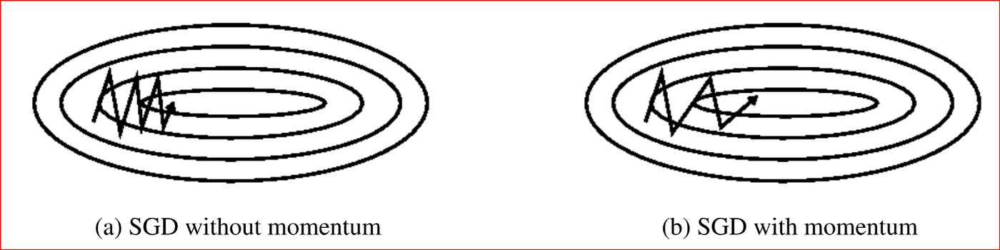
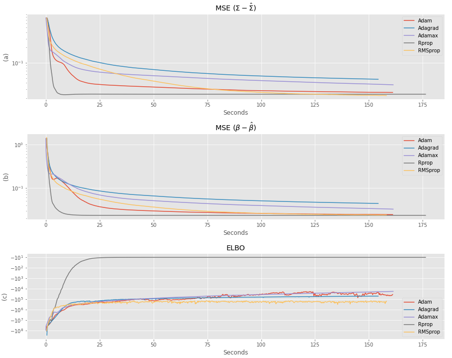
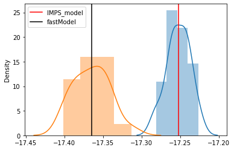
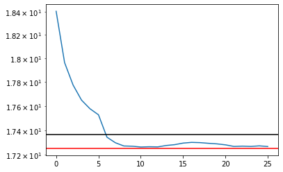

---

# .small[Large scale problems] 

**Sophisticated Adaptive Stochastic Gradient Descent **

- Rprop (1993) uses the gradient sign and update each variable independently:

- AdaGrad (2011) uses adaptive coordinate-wise step-sizes

- RMSProp (2012) adds momentum to the step-sizes
  
- Adam (2015) also adds momentum to the gradients

```{r, echo = FALSE}

```

$\rightsquigarrow$ All available in **Pytorch** with auto-differentiation.

---

# Optimizers comparison

```{r, echo = FALSE, out.width='65%', fig.align='center', fig.cap="n = 1,000, p = 200, d = 2. Rprop is much faster."}

```

---

# Performance

```{r, echo = FALSE, out.width='65%', fig.align='center', fig.cap="n = 10,000, p = 2,000, d = 2 (running time: 1 min 40s)"}
knitr::include_graphics("figs/final_n=10000,p=2000.png")
```

$\rightsquigarrow$ Work up to $n = 100,000$, $p = 10,000s$

---

# Exact likelihood maximization  

With B. Batardière, J. Kwon

To compare and assess at least empirically the performance of the VE-M estimator

  - Use importance sampling to estimate the likelihood: 

 $$p_{\theta}(Y_i) = \int \tilde p_{\theta}(Y_i|Z) p(Z)  \mathrm d Z = \int \tilde p_{\theta}(Z) \mathrm d Z \approx \frac 1 {n_s} \sum_{k=1}^{n_s} \frac {\tilde p_{\theta}(V_k)}{g(V_k)}, ~ ~ ~(V_{k})_{1 \leq k \leq n_s} \overset{iid}{\sim} g$$
 
  - Estimate the gradients of the log-likelihood by plug-in: 

  $$\nabla _{\theta} \log p_{\theta}(Y_i) \approx \nabla_{\theta} \log\left(\frac 1 {n_s} \sum_{k=1}^{n_s} \frac {\tilde p_{\theta}^{(u)}(V_k)}{g(V_k)}\right)$$

  - Use SAGA (F. Bach), a smart incremental gradient descent approach 

$\rightsquigarrow$ Work up to $n=1,000, p = 30$, $n=1,000, q = 30, p >> q$ for PCA variant

---

# .small[Comparing exact and variational estimators]


.pull-left[
```{r, echo = FALSE, out.width='85%', fig.align='center', fig.cap="Log-likelihood computed with importance sampling and variational estimators on 20 replicates"}

```
]

.pull-right[
```{r, echo = FALSE, out.width='85%', fig.align='center', fig.cap="Same, on a single run (blue = IS, black = fastPLN, red = true log-likelihood"}

```
]

The true log-likelihood used for comparison is computed numerically.
