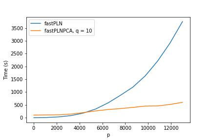
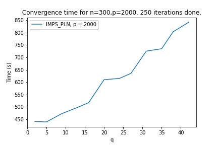

---

# Consider the PLN-PCA variant

Useful for high-dimensional, large problems.

<br/>


$$\begin{aligned}
\mathbf{Z}_i &=  \mathbf{B}^\intercal x_i+ \mathbf{C} W_i, \qquad W_{i} \sim \mathcal{N}\left(0, I_{q}\right) \\[1.25ex]
\mathbf{Y}_i  \mid \mathbf{Z}_i & \sim \mathcal{P}\left(\exp \left( \mathbf{Z}_i\right)\right) \\
\end{aligned}$$

where $q\leq p$ is the dimension of the latent space. The model parameters encompass

<br/>

  - The matrix of regression parameters $\mathbf{B} = (\beta _{kj})_{1 \leq k \leq d, 1 \leq j \leq p}$,
  - The matrix $\mathbf{C} \in \mathbb R^{p\times q}$ sending the latent variable $W_i$ from $\mathbb{R}^q$ to $\mathbb{R}^p$.

If $p = q$, $\theta = (\mathbf{B}, \Sigma = \mathbf{C} \mathbf{C}^\intercal)$, .important[standard PLN]

If $q < p$, $\theta = (\beta, C)$, .important[PLN-PCA]

<br/>

We regularize by .important[controling the number of parameters] (or size of the subspace) with $q$

---
# Performance of V-EM for PLN-PCA

```{r, out.width='60%', echo=FALSE, fig.align='center', fig.cap="Running times for $n=1000, q=10, d=1$."}

```

- **PLN**: convergence in a small number of iterations but with $\mathcal{O}(n p + p^2)$ parameters to optimize + inversion of $\hat{\Sigma} (p\times p)$
- **PLN-PCA**: convergence for a large number of iterations, with $\mathcal{O}(n p + p q)$ parameters to optimize + inversion of $\hat{\Sigma} (q\times q)$

---
# Direct optimization

We already have an efficient V-EM, but without guarantees "out-of-the box".

<br/>

### .content-box-red[.small[Direct optimization by approximating the gradient of the objective]]

.content-box-yellow[


$$\begin{aligned}
\nabla_{\theta} \sum _{i =1}^n \log p_{\theta}(Y_i) & = \sum _{i =1}^n \nabla_{\theta}  \log \left(  \int_{R^q} p_{\theta} (Y_i|W_i) p(W_i)\mathrm{d} W_i \right) \\ & = \sum _{i =1} ^n \nabla_{\theta} \log \mathbb{E}_W (p_\theta(Y_i|W_i)) \\
\end{aligned}$$
]

<br/>

### Algorithm principle

- Ingredient 1: fancy SG ascent with variance reduction (e.g. Adagrad + SAGA)
- Ingredient 2: Monte-Carlo/Importance sampling to estimate the gradient


---
# Monte-Carlo estimation of the gradient

### Gradient derivation .small[(First Louis Formula)]

$$\begin{aligned}
\nabla_{\theta}  \log \mathbb{E}_{W}\left[  p_{\theta} (Y_i|W)  \right]  & = \frac {\nabla_{\theta}   \mathbb{E}_{W}\left[  p_{\theta} (Y_i|W)  \right]}{\mathbb{E}_{W}\left[  p_{\theta} (Y_i|W)  \right]} = \frac {\mathbb{E}_{W}\left[  \nabla_{\theta} p_{\theta} (Y_i|W)  \right]}{\mathbb{E}_{W}\left[  p_{\theta} (Y_i|W)  \right]} \\ & = \frac {\mathbb{E}_{W}\left[ p_{\theta} (Y_i|W) \nabla_{\theta} \log(p_{\theta} (Y_i|W))  \right]}{\mathbb{E}_{W}\left[  p_{\theta} (Y_i|W)  \right]} = \frac{\bar N}{\bar D} \\
\end{aligned}$$

--

### Approximation via Importance Sampling 

Our estimator of the numerator and the denominator are respectively, drawing $V_k \sim \phi(.)$,

$$\bar N = \frac 1 {n_s} \sum_{k=1}^{n_s} \frac {p(V_k)}{\phi(V_k)} p_\theta(Y_i|V_k) \nabla_{\theta}\log p_\theta(Y_i| V_k), \bar D = \frac 1 {n_s} \sum_{k=1}^{n_s} \frac {p(V_k)}{\phi(V_k)} p_\theta(Y_i| V_k),$$

and the ratio can be seen as a self normalizing weighted IS approach:

$$\bar N/\bar D = \frac 1 {n_s} \sum_k^{n_s} \tilde{w}_k \nabla_{\theta}\log p_\theta(Y_i| V_k), \quad w_k = \frac {p(V_k)p_\theta(Y_i|V_k)}{\phi(V_k)}, \quad \tilde{w}_k = w_k/\sum_k w_k$$


---
# How to choose the proposition law $\phi$
  
Choose $\phi$ as close as possible as $p_\theta (Y|W)p(W) \varpropto p_\theta(W | Y)$,

Since $p(W)$ is Gaussian, we choose $\phi$ Gaussian with

- mean $m = \mathbb{E}_W\left[W |Y \right]$, estimated using IS with weights recycled from the previous iterations.

- covariance $\Sigma$, estimated from the 2nd derivative taken in $m$ (explicit)

$$\Omega^{-1} = - \nabla_{WW} \log p_{\theta}(Y_i| W) p(W) \bigg|_{W = m}$$
### Expected theoretical guarantees

- Gaussian proposition law does not give bounded weights and finite variance in theory
- Student proposition law does, leading to theoretical guarantees on the estimator 
- In practice, Gaussian or Student proposition law gives the same effective sample size. 

$\rightsquigarrow$ CI intervals seems to work OK


---

# Performance of Importance Sampling (1)

Varying $p$

```{r, out.width='80%', echo=FALSE, fig.align='center', fig.cap="Running times for $n=300, q=10, d=1$, 250 iterations."}
knitr::include_graphics("figs/Convergence_analysis_IMPS_PLN_n=300,q=10,250_iterations.png")
```

---

# Performance of Importance Sampling (2)

Varying $q$

```{r, out.width='80%', echo=FALSE, fig.align='center', fig.cap="Running times for $n=300, p=2000, d=1$, 250 iterations."}

```

---

# V-EM vs Importance Sampling

<br/>

Example with $n=p=1000$, $d=1, q=10$, Toeplitz (AR-like) covariance

<br/>

```{r, out.width='110%',  fig.align='center', echo=FALSE}
knitr::include_graphics("figs/ELBOvslikelihood.png")
```

<br/>

- orange: ELBO of the V-EM
- red: log-likelihood found by IMPS at convergence
- blue: log-likelihood computed with current V-EM estimates


