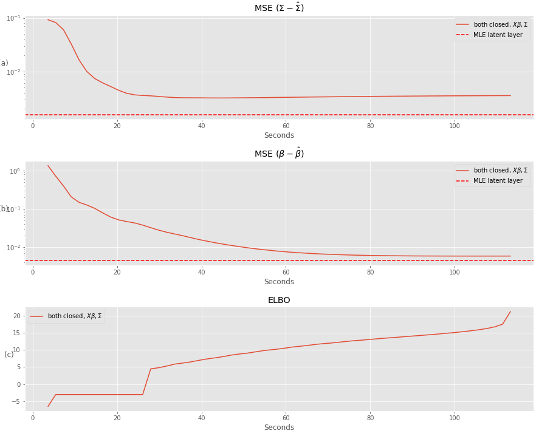

---
# Inference: general ingredients
  
Estimate $\theta = (\mathbf{B}, \boldsymbol\Sigma)$, predict the $\mathbf{Z}_i$, while  the model marginal likelihood is

$$p_\theta(\mathbf{Y}_i) = \int_{\mathbb{R}_p} \prod_{j=1}^p p_\theta(Y_{ij} | Z_{ij}) \, p_\theta(\mathbf{Z}_i) \mathrm{d}\mathbf{Z}_i$$

### Expectation-Maximization

With $\mathcal{H}(p) = -\mathbb{E}_p(\log(p))$ the entropy of $p$,

$$\log p_\theta(\mathbf{Y}) = \mathbb{E}_{p_\theta(\mathbf{Z}\,|\,\mathbf{Y})} [\log p_\theta(\mathbf{Y}, \mathbf{Z})] + \mathcal{H}[p_\theta(\mathbf{Z}\,|\,\mathbf{Y})]$$ 

EM requires to evaluate (some moments of) $p_\theta(\mathbf{Z} \,|\,  \mathbf{Y})$, but there is no close form!

### Variational approximation `r Citep(myBib, "WaJ08")`

Use a proxy $q_\psi$ of $p_\theta(\mathbf{Z}\,|\,\mathbf{Y})$ minimizing a divergence in a class $\mathcal{Q}$ .small[(e.g, Küllback-Leibler divergence]

$$q_\psi(\mathbf{Z})^\star  \arg\min_{q\in\mathcal{Q}} D\left(q(\mathbf{Z}), p(\mathbf{Z} | \mathbf{Y})\right), \, \text{e.g.}, D(.,.) = KL(., .) = \mathbb{E}_{q_\psi}\left[\log \frac{q(z)}{p(z)}\right].$$

---
# Inference: specific ingredients

Consider $\mathcal{Q}$ the class of diagonal multivariate Gaussian distributions:

$$\Big\{q: \, q(\mathbf{Z}) = \prod_i q_i(\mathbf{Z}_i), \, q_i(\mathbf{Z}_i) = \mathcal{N}\left(\mathbf{Z}_i; \mathbf{m}_i, \mathrm{diag}(\mathbf{s}_i \circ \mathbf{s}_i)\right), \boldsymbol\psi_i = (\mathbf{m}_i, \mathbf{s}_i) \in\mathbb{R}_p\times\mathbb{R}_p \Big\}$$

and maximize the ELBO (Evidence Lower BOund)

$$\begin{aligned}J(\theta, \psi) & = \log p_\theta(\mathbf{Y}) - KL[q_\psi (\mathbf{Z}) ||  p_\theta(\mathbf{Z} | \mathbf{Y})] \\ & = \mathbb{E}_{\psi} [\log p_\theta(\mathbf{Y}, \mathbf{Z})] + \mathcal{H}[q_\psi(\mathbf{Z})] \\  & 
= \frac{1}{n} \sum_{i = 1}^n J_i(\theta, \psi_i),\end{aligned}$$

where, letting $\mathbf{A}_i = \mathbb{E}_{q_i}[\exp(Z_i)] = \exp\left( \mathbf{o}_i + \mathbf{m}_i + \frac{1}{2}\mathbf{s}^2_i\right)$, we have

$$\begin{aligned}
J_i(\theta, \psi_i) = &\mathbf{Y}_i^\intercal(\mathbf{o}_i + \mathbf{m}_i) - \left(\mathbf{A}_i - \frac{1}{2}\log(\mathbf{s}^2_i)\right) ^\intercal \mathbf{1}_p + \frac{1}{2} |\log|{\boldsymbol\Omega}|  \\
& - \frac{1}{2}(\mathbf{m}_i - \boldsymbol{\Theta}\mathbf{x}_i)^\intercal \boldsymbol{\Omega} (\mathbf{m}_i - \boldsymbol{\Theta}\mathbf{x}_i) - \frac{1}{2} \mathrm{diag}(\boldsymbol\Omega)^\intercal\mathbf{s}^2_i + \mathrm{cst} 
\end{aligned}$$

---
# Resulting Variational EM

.important[Alternate] until convergence between

  - VE step: optimize $\boldsymbol{\psi}$ (can be written individually)
$$\boldsymbol{\psi}_i^{(h)} = \arg \max J_{i}(\theta^{(h)}, \boldsymbol{\psi}_i) \left( = \arg\min_{q_i} KL[q_i(\mathbf{Z}_i) \,||\, p_{\theta^h}(\mathbf{Z}_i\,|\,\mathbf{Y}_i)] \right)$$
  - M step: optimize $\theta$
$$\theta^{(h)} = \arg\max \frac{1}{n}\sum_{i=1}^{n}J_{Y_i}(\theta, \boldsymbol{\psi}_i^{(h)})$$

We end up with 

$$
\begin{equation}
\hat{\theta}^{\text{ve}} = \arg\max_{\theta} \left( \frac{1}{n}\sum_{i=1}^{n} \sup_{\boldsymbol{\psi}_i} J_i(\theta, \boldsymbol{\psi}_i) \right)  = \arg\max_{\theta} \underbrace{\left(\frac{1}{n}\sum_{i=1}^{n} \bar{J}_i(\theta) \right)}_{\bar{J}_n(\theta)} 
\end{equation}
$$
where $\bar{J}_i(\theta) = \sup_{\psi_i} J_i(\theta,\psi_i)$ is the *profiled* objective function.

---
# Optimization of simple PLN models

### Property of the objective function
  
The ELBO $J(\theta, \psi)$ is bi-concave, i.e.
  - concave wrt $\psi = (\mathbf{M}, \mathbf{S})$ for given $\theta$ 
  - convace wrt $\theta = (\boldsymbol\Sigma, \mathbf{B})$ for given $\psi$ 

but .important[not jointly concave] in general.

### M-step: analytical

$$\hat{{\mathbf{B}}} = \left(\mathbf{X}^\top \mathbf{X}\right)^{-1} \mathbf{X} \mathbf{M}, \quad 
   \hat{{\boldsymbol\Sigma}} = \frac{1}{n} \left(\mathbf{M}-\mathbf{X}\hat{{\mathbf{B}}}\right)^\top \left(\mathbf{M}-\mathbf{X}\hat{\mathbf{B}}\right) + \frac{1}{n} \mathrm{diag}(\mathbf{1}^\intercal\mathbf{S}^2)$$

### VE-step: gradient ascent

$$\frac{\partial J(\psi)}{\partial \mathbf{M}} =  \left(\mathbf{Y} - \mathbf{A} - (\mathbf{M} - \mathbf{X}{\mathbf{B}}) \mathbf{\Omega}\right), \qquad \frac{\partial J(\psi)}{\partial \mathbf{S}} = \frac{1}{\mathbf{S}} - \mathbf{S} \circ \mathbf{A} - \mathbf{S} \mathrm{D}_{\boldsymbol\Omega} .$$

---
# Implementation and algorithms

#### Medium scale problems

  - **algorithm**: conservative convex separable approximations `r Citep(myBib, "Svan02")`
  - **implementation**: `NLopt` nonlinear-optimization library `r Citep(myBib, "nlopt")` <br/>
$\rightsquigarrow$ up to a thousand of sites ( $n \approx 1000$ ), hundreds of species ( $p\approx 100s$ )

#### Large scale problems

  - **algorithm**: Rprop (gradient sign + adaptive variable-specific update) `r Citep(myBib, "rprop")`
  - **implementation**: `torch` with GPU auto-differentiation `r Citep(myBib, c("torch", "pytorch"))` <br/>
$\rightsquigarrow$ Up to  $n \approx 100,000$ and $p\approx 10,000s$

```{r, echo = FALSE, out.width='30%', fig.align='center', fig.cap="n = 10,000, p = 2,000, d = 2 (running time: 1 min 40s)"}

```
