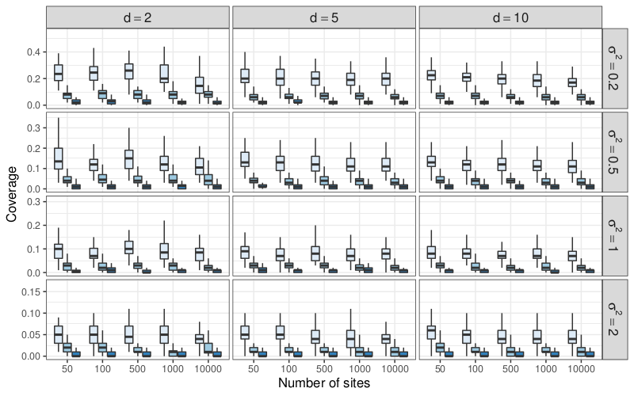

---
# Asymptotic consistency (?)

Let $\hat{\psi}_i = \hat{\psi}_i(\theta, \mathbf{Y}_i) = \arg \max_{\psi} J_i(\theta, \psi)$ and consider the stochastic map $\bar{J}_n$ defined by:

$$\bar{J}_n \; : \quad \theta \mapsto \frac{1}{n}\sum_{i=1}^{n} J_i(\theta, \hat{\psi}_i) \stackrel{\Delta}{=} \frac{1}{n}\sum_{i=1}^{n} \bar{J}_i(\theta)$$

M-estimation suggests that $\hat{\theta} = \arg\max_{\theta} \bar{J}_{n}(\theta)$ should converge to $\bar{\theta} = \arg\max_{\theta} \bar{J}(\theta)$ where $\bar{J}(\theta) = \mathbb{E}_{\theta^\star}[\bar{J}_\mathbf{Y}(\theta)] =  \mathbb{E}_{\theta^\star}[J_\mathbf{Y}(\theta, \hat{\psi}(\theta, \mathbf{Y}))]$. 

--

### Theorem `r Citep(myBib, "Westling2015")`

Under regularity condtions ensuring that $\bar{J}_n$ is smooth enough (and satisfied for example when $\theta$ and $\psi_i$ are restricted to compact sets), we have indeed: 
$$
\hat{\theta} \xrightarrow[n \to +\infty]{a.e.} \bar{\theta}
$$

--

.important[Open question:] $\bar{\theta} = \theta^\star$ ? No formal results as $J$ is untractable but numerical evidence suggest so.

---
# Numerical study

## Study Bias and coverage of the estimator

- number of samples $n \in \{30, 250, 500, 1000 \}$

- number of variables $p = 50$

- number of covariates $d \in \{2, 4\}$

- sampling effort (TSS) $\approx 10^4$

- noise level $\sigma^2 \in \{0.25, 1, 4\}$

- $\boldsymbol\Sigma$ as $\sigma_{jk} = \sigma^2 \rho^{|j-k|}$, with $\rho = 0.2$

- $\mathbf{\Theta}$ with entries sampled from $\mathcal{N}(0,1/d)$


---

# Bias of $\hat{\boldsymbol B}$


$\rightsquigarrow$ .important[asymptotically unbiased]

---

# Root mean square error of $\hat{\boldsymbol B}$


$\rightsquigarrow$ .important[asymptotically unbiased]

---
# Statistical Inference

.content-box-red[We only consider the standard PLN model.]

## A first try: Wald test

Test $\mathcal{H}_0: R \theta = r_0$ with the statistic
$$ (R \hat{\theta} - r_0)^\top \left[n R\hat{\mathbb{V}}(\hat{\theta}) R^\top \right]^{-1} (R \hat{\theta} - r_0) \sim \chi_k^2 \quad \text{where} \quad k = \text{rank}(R).$$

The Fisher Information matrix

$$I(\hat{\theta}) = -  \mathbb{E}_\theta \left[ \frac{\partial^2 \log \ell(\theta; x)}{\partial  \theta^2} \right]$$

can be used as an approximation of $n\mathbb{V}(\hat{\theta})^{-1}$.

## Application

Derive confidences interval for the inverse covariance $\mathbf{\Omega}$ and the regression parameters $\mathbf{\Theta}$.

---

# Variational Wald-test


## Variational Fisher Information


The Fisher information matrix is given by

$$I(\theta) = \begin{pmatrix}
  \frac{1}{n}(\mathbf{I}_p \otimes 
\mathbf{X}^\top)\mathrm{diag}(\mathrm{vec}(\mathbf{A}))(\mathbf{I}_p \otimes \mathbf{X}) & \mathbf{0} \\
  \mathbf{0} & \frac12\mathbf{\Omega}^{-1} \otimes 
\mathbf{\Omega}^{-1} 
  \end{pmatrix}$$

and can be inverted blockwise to estimate $\mathbb{V}(\hat{\theta})$.

## Wald test and coverage

- $\hat{\mathbb{V}}(\mathbf{\Theta}_{kj}) = [n (\mathbf{X}^\top \mathrm{diag}(\mathrm{vec}(\hat{A}_{.j})) \mathbf{X})^{-1}]_{kk}$
- $\hat{\mathbb{V}}(\Omega_{kl}) = 2\Omega_{kk}\Omega_{ll}$

The confidence intervals at level $\alpha$ are given by 

- $B_{kj} =  \hat{B}_{kj} \pm \frac{q_{1 - \alpha/2}}{\sqrt{n}} \sqrt{\hat{\mathbb{V}}(\mathbf{\Theta}_{kj})}$ 
- $\Omega_{kl} =  \hat{\Omega}_{kl} \pm \frac{q_{1 - \alpha/2}}{\sqrt{n}} \sqrt{\hat{\mathbb{V}}(\Omega_{kl})}$. 

---

# Asymptotic consistency (?)

Let $\hat{\psi}_i = \hat{\psi}_i(\theta, Y_i) = \arg \max_{\psi} J_i(\theta, \psi)$ and consider the stochastic map $\bar{J}_n$ defined by:

$$\bar{J}_n \; : \quad \theta \mapsto \frac{1}{n}\sum_{i=1}^{n} J_i(\theta, \hat{\psi}_i) \stackrel{\Delta}{=} \frac{1}{n}\sum_{i=1}^{n} \bar{J}_i(\theta)$$

M-estimation suggests that $\hat{\theta} = \arg\max_{\theta} \bar{J}_{n}(\theta)$ should converge to $\bar{\theta} = \arg\max_{\theta} \bar{J}(\theta)$ where $\bar{J}(\theta) = \mathbb{E}_{\theta^\star}[\bar{J}_\mathbf{Y}(\theta)] =  \mathbb{E}_{\theta^\star}[J_\mathbf{Y}(\theta, \hat{\psi}(\theta, \mathbf{Y}))]$. 

### Theorem `r Citep(myBib, "Westling2015")`

Under regularity condtions ensuring that $\bar{J}_n$ is smooth enough (and satisfied for example when $\theta$ and $\psi_i$ are restricted to compact sets), we have indeed: 
$$
\hat{\theta} \xrightarrow[n \to +\infty]{a.e.} \bar{\theta}
$$

.important[Open question:] $\bar{\theta} = \theta^\star$ ? No formal results as $J$ is untractable but numerical evidence suggest so.

---

# Numerical study

## Study Bias and coverage of the estimator

- number of samples $n \in \{50, 100, 500, 1000, 10000\}$

- number of species/genes $p \in \{20, 200\}$

- number of covariates $d \in \{2, 5, 10\}$

- sampling effort $TSS \in \{\text{low}, \text{medium}, \text{high}\}$ ($\approx 10^4$, $10^5$ and $10^6$)

- noise level $\sigma^2 \in \{0.2, 0.5, 1, 2\}$

- $\boldsymbol\Sigma$ as $\sigma_{jk} = \sigma^2 \rho^{|j-k|}$, with $\rho = 0.2$

- $\mathbf{\Theta}$ with entries sampled from $\mathcal{N}(0,1/d)$


---

# Bias of $\hat{\boldsymbol\Theta}$

```{r, echo = FALSE, out.width='80%', fig.align='center', fig.cap="The variational estimator are asymptotically unbiased"}
knitr::include_graphics("figs/PLN_bias.png")
```

---

# 95% confident interval - Coverage

```{r, echo = FALSE, out.width='70%', fig.align='center', fig.cap="Variance underestimated, no trusted confidence intervals can be derived out-of-the box"}

```

---
# Asymptotic normality

### Theorem `r Citep(myBib, "Westling2015")`

Under additional regularity condtions (still satisfied for example when $\theta$ and $\psi_i$ are restricted to compact sets), we have indeed: 
$$
\sqrt{n}(\hat{\theta} - \bar{\theta})  \xrightarrow[]{d} \mathcal{N}(0, V(\bar{\theta}))
$$
where $V(\theta) = C(\theta)^{-1} D(\theta) C(\theta)^{-1}$ for 
$$
\begin{aligned}
 C(\theta) = \mathbb{E}[\nabla_{\theta\theta} \bar{J}_Y(\theta) ] \quad \mathrm{and} \quad 
 D(\theta) = \mathbb{E}\left[(\nabla_{\theta} \bar{J}_Y(\theta)) (\nabla_{\theta} \bar{J}_Y(\theta)^\intercal \right]
\end{aligned}
$$

### Practical computations .small[chain rule]

$$
\begin{aligned}
\nabla_{\theta\theta} \bar{J}_{Y}(\theta) = \left[\nabla_{\theta\theta} J_{Y} - \nabla_{\theta \psi} J_{Y} (\nabla_{\psi\psi} J_{Y})^{-1} \nabla_{\psi\theta} J_{Y}\right] (\theta, \hat{\psi}) \text{ and } \nabla_{\theta} \bar{J}_{Y}(\theta) = \nabla_{\theta} J_{Y}(\theta, \hat{\psi})
\end{aligned}
$$

$$
\begin{aligned}
 \hat{C}_n(\theta) & = \frac{1}{n} \sum_{i=1}^n \left[ \nabla_{\theta\theta} J_i - \nabla_{\theta\psi_i} J_i (\nabla_{\psi_i\psi_i} J_i)^{-1} \nabla_{\theta\psi_i} J_i^\intercal \right](\theta, \hat{\psi}_i) \\
 \hat{D}_n(\theta) & = \frac{1}{n} \sum_{i=1}^n \left[ \nabla_{\theta} J_i \nabla_{\theta} J_i^\intercal \right](\theta, \hat{\psi}_i)
\end{aligned}
$$

---
# Reasonably ugly formula
 
Additional efforts and computational tricks give:

$$
\begin{aligned}
\hat{D}_n(\theta) = \frac{1}{n} \sum_{i=1}^n \left[ (\mathbf{Y}_i - \mathbf{A}_i)(\mathbf{Y}_i - \mathbf{A}_i)^\intercal \right] \otimes \mathbf{x}_i \mathbf{x}_i^\intercal \in \mathbb{R}^{dp \times dp}
\end{aligned}
$$
and 

$$
\begin{aligned}
\hat{C}_n(\theta) = - \frac{1}{n} \sum_{i=1}^n \left[ \mathbf{D}_i^{1/2} \mathbf{C}_i (\mathbf{C}_i^{-1} - \mathbf{B}_i) \mathbf{C}_i \mathbf{D}_i^{1/2} \right] \otimes \mathbf{x}_i \mathbf{x}_i^\intercal \in \mathbb{R}^{dp \times dp}
\end{aligned}
$$
where $\mathbf{D}_i = \mathrm{diag}(\mathbf{A}_i)$ and 

$$
\begin{aligned}
\mathbf{C}_i = \mathrm{diag}\left( \frac{\mathbf{2}_p}{\mathbf{2}_p + \mathbf{s}_i^2\mathbf{A}_i}\right) \quad \text{and} \quad 
\mathbf{B}_i = \left[\mathbf{C}_i + \mathbf{D}_i^{-1/2} \boldsymbol{\Omega} \mathbf{D}_i^{-1/2} \right]^{-1} 
\end{aligned}
$$

Yet to be implemented...
