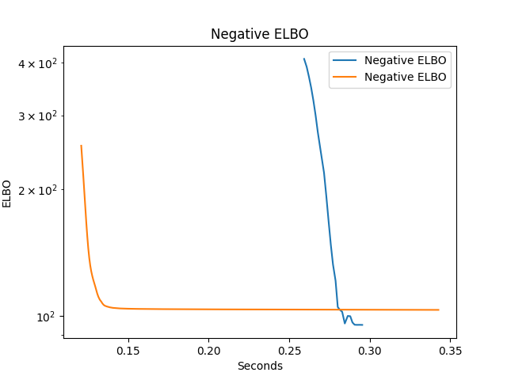
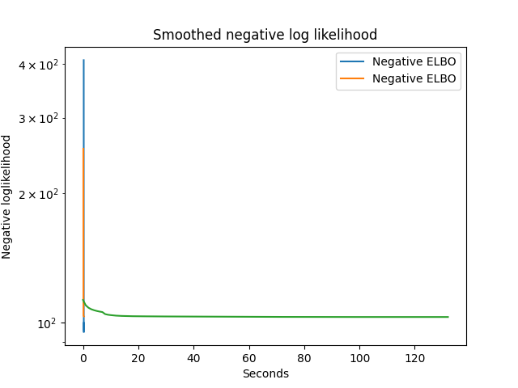

---

# PLN Python package

### Installation

Clone the github repository

```{bash pyPLNmodels git repos, eval=FALSE, tidy=FALSE}
git clone https://github.com/pln-team/pyPLNmodels
```

Create an environment

```{bash pyPLNmodels environment, eval=FALSE, tidy=FALSE}
conda create --name pyPLNmodels
conda activate pyPLNmodels
```

Install Pytorch (see  [https://pytorch.org/](https://pytorch.org/))

```{bash pytorch install, eval=FALSE, tidy=FALSE}
conda install pytorch torchvision torchaudio cudatoolkit=10.2 -c pytorch
```

Install the module  `pyPLNmodels` with dependencies

```{bash pyPLNmodels install, eval=FALSE, tidy=FALSE}
pip install pyPLNmodels
```


---
  
  
# PLN Python package
  
### Load the package
  
Amaizingly works from `RStudio` with **reticulate** correctly configured:
  
```{r pyPLNmodels config reticulate, eval = FALSE, warning=FALSE}
library(reticulate)
use_condaenv("pyPLNmodels")
```

Once included, then in a Python chunk, you need

```{python loading package, message=FALSE}
from pyPLNmodels.models import PLNmodel, fastPLN, fastPLNPCA, IMPS_PLN
```

### Load the data
  
In Python, (data set with $p = 50, n = 200, d = 2$)

```{python, import oaks data, warning = FALSE}
import pandas as pd 
Y = pd.read_csv("data-oaks/Y.csv")
X = pd.read_csv("data-oaks/X.csv")
O = pd.read_csv("data-oaks/O.csv")
```

---
  
# Fast PLN

```{python fastPLN1, eval = FALSE}
mypln = fastPLN()
mypln.fit(Y, O , X)
```
  
```{python fastPLN2, echo = FALSE, cache=TRUE, results='hide'}
mypln = fastPLN()
mypln.fit(Y, O , X)
mypln.show_loss(name_doss="example_pln_criterion.png", save=True)
```

```{r, out.width='60%', echo=FALSE}
knitr::include_graphics("example_pln_criterion.png")
```

---
  
# Fast PLN-PCA

```{python, eval = FALSE}
myplnpca = fastPLNPCA(q=5)
myplnpca.fit(Y, O, X)
```
  
```{python, cache=TRUE, echo = FALSE, message=FALSE, results='hide'}
myplnpca = fastPLNPCA(q=5)
myplnpca.fit(Y, O, X)
myplnpca.show_loss(name_doss="example_plnpca_criterion.png", save=True)
```

```{r, out.width='60%', echo=FALSE}

```

---

# Importance Sampling for PLN-PCA


```{python, eval = FALSE}
imps = IMPS_PLN(q=5)
imps.fit(Y, O, X)
```

```{python, cache=TRUE, echo = FALSE, message=FALSE, results='hide'}
imps = IMPS_PLN(q=5)
imps.fit(Y, O, X)
imps.show_loss(name_doss="example_imps_criterion.png", save=True)
```


```{r, out.width='60%', echo=FALSE}

```

