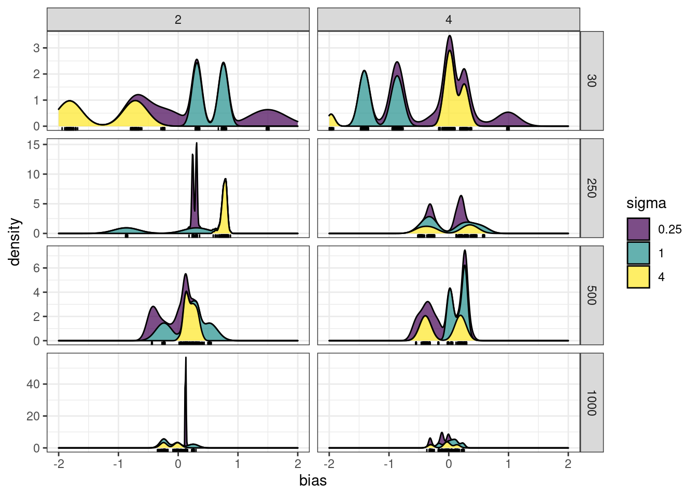
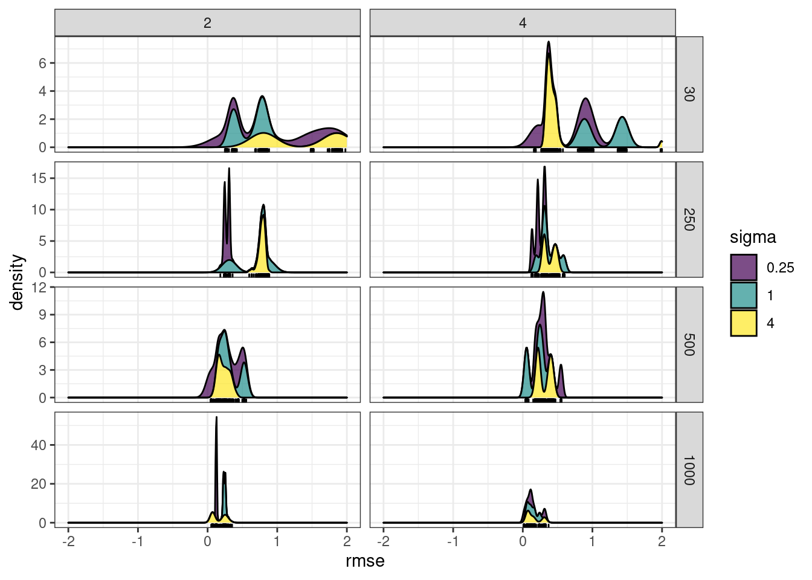
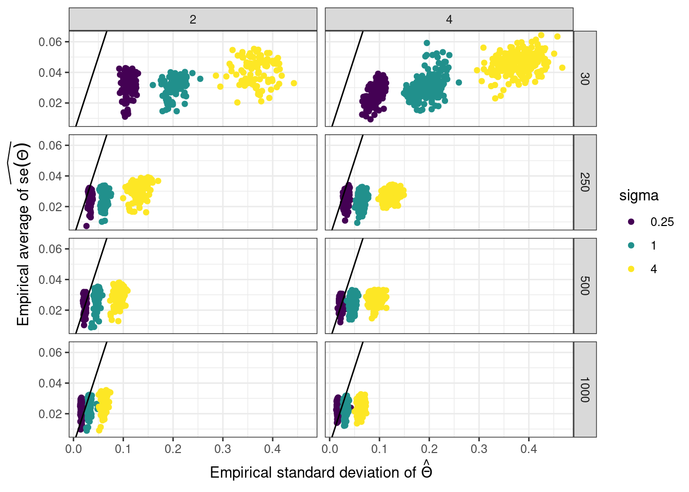
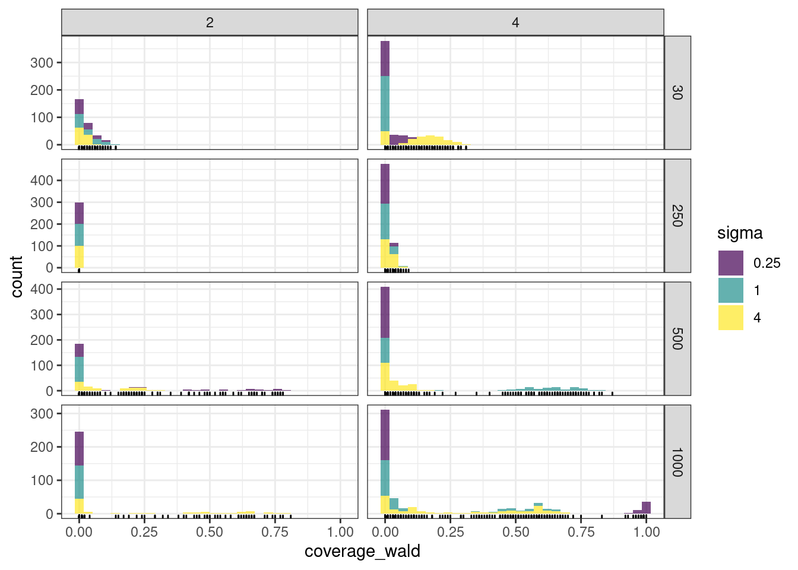
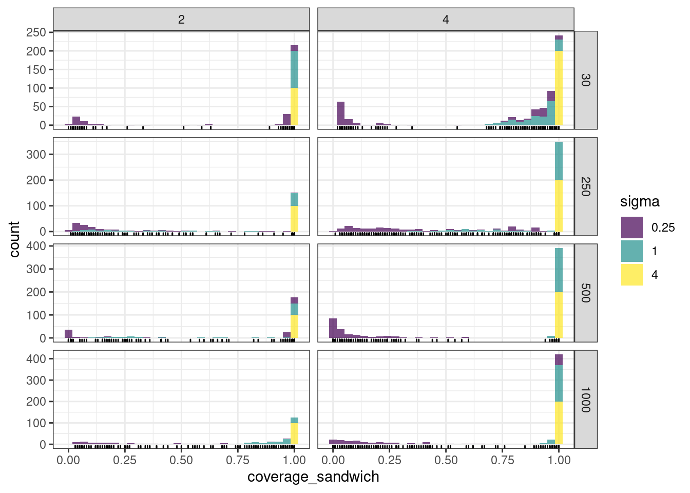

---
# Estimator Bias and consistency

### M-estimation framework `r Citep(myBib, "van2000asymptotic")`

Let $\hat{\psi}_i = \hat{\psi}_i(\theta, \mathbf{Y}_i) = \arg \max_{\psi} J_i(\theta, \psi)$ and consider the stochastic map $\bar{J}_n$ defined by

$$\bar{J}_n \; : \quad \theta \mapsto \frac{1}{n}\sum_{i=1}^{n} J_i(\theta, \hat{\psi}_i) \stackrel{\Delta}{=} \frac{1}{n}\sum_{i=1}^{n} 
\bar{J}_i(\theta)$$

M-estimation suggests that $\hat{\theta}^{\text{ve}} = \arg\max_{\theta} \bar{J}_{n}(\theta)$ should converge to $\bar{\theta} = \arg\max_{\theta} \bar{J}(\theta)$ where $\bar{J}(\theta) = \mathbb{E}_{\theta^\star}[\bar{J}_Y(\theta)] =  \mathbb{E}_{\theta^\star}[J_Y(\theta, \hat{\psi}(\theta, Y))]$. 

### Theorem `r Citep(myBib, "Westling2015")`

In this line, `r Citet(myBib, "Westling2015")` show that under regularity conditions ensuring that $\bar{J}_n$ is smooth enough (e.g. when $\theta$ and $\psi_i$ are restricted to compact sets), 
$$
\hat{\theta}^{\text{ve}} \xrightarrow[n \to +\infty]{a.e.} \bar{\theta}
$$

.important[Open question:] $\bar{\theta} = \theta^\star$ ? No formal results as $\bar{J}$ is untractable but numerical evidence suggests so.

---
# Numerical study

## Study Bias of the estimator of $\hat{\boldsymbol B}$

- number of variables $p = 50$

- number of covariates $d \in \{2, 4\}$

- number of samples $n \in \{30, 250, 500, 1000 \}$

- sampling effort (TSS) $\approx 10^4$

- $\boldsymbol\Sigma$ as $\sigma_{jk} = \sigma^2 \rho^{|j-k|}$, with $\rho = 0.2$

- $\mathbf{B}$ with entries sampled from $\mathcal{N}(0,1/d)$

- noise level $\sigma^2 \in \{0.25, 1, 4\}$

- 100 replicates
---

# Bias of $\hat{\boldsymbol B}$

```{r, echo = FALSE, out.width='85%', fig.align='center', fig.cap="Bias vanishes with $n$"}

```

$\rightsquigarrow$ .important[asymptotically unbiased]

---

# Root mean square error of $\hat{\boldsymbol B}$

```{r, echo = FALSE, out.width='85%', fig.align='center', fig.cap="RMSE vanishes with $n$"}

```

<!-- --- -->
<!-- # Estimator Variance -->

<!-- ## Motivation: Wald test -->

<!-- Test $\mathcal{H}_0: R \theta = r_0$ with the statistic -->
<!-- $$ (R \hat{\theta} - r_0)^\top \left[n R\hat{\mathbb{V}}(\hat{\theta}) R^\top \right]^{-1} (R \hat{\theta} - r_0) \sim \chi_k^2 \quad \text{where} \quad k = \text{rank}(R).$$ -->

<!-- If $\hat{\theta}$ is the MLE, then the Fisher Information matrix -->

<!-- $$I(\theta) = -  \mathbb{E}_\theta \left[ \frac{\partial^2 \log \ell(\theta; x)}{\partial  \theta^2} \right]$$ -->

<!-- can be used to build an approximation of $n\mathbb{V}(\hat{\theta})^{-1}$. -->

<!-- ## Application -->

<!-- Derive confidence intervals for the inverse covariance $\mathbf{\Omega}$ and the regression parameters $\mathbf{B}$. -->

---

# Variance: naïve approach

Do as if $\hat{\theta}^{\text{ve}}$ was a MLE and $\bar{J}_n$ the log-likelihood.

### Variational Fisher Information

The Fisher information matrix is given by (from the Hessian of $J$) by

$$I_n(\hat{\theta}^{\text{ve}}) = \begin{pmatrix}
  \frac{1}{n}(\mathbf{I}_p \otimes 
\mathbf{X}^\top)\mathrm{diag}(\mathrm{vec}(\mathbf{A}))(\mathbf{I}_p \otimes \mathbf{X}) & \mathbf{0} \\
  \mathbf{0} & \frac12\mathbf{\Omega}^{-1} \otimes 
\mathbf{\Omega}^{-1} 
  \end{pmatrix}$$

and can be inverted blockwise to estimate $\mathbb{V}(\hat{\theta})$.

### Confidence intervals and coverage

$\hat{\mathbb{V}}(B_{kj}) = [n (\mathbf{X}^\top \mathrm{diag}(\mathrm{vec}(\hat{A}_{.j})) \mathbf{X})^{-1}]_{kk}, \qquad \hat{\mathbb{V}}(\Omega_{kl}) = 2\hat{\Omega}_{kk}\hat{\Omega}_{ll}$

The confidence intervals at level $\alpha$ are given by 

$B_{kj} =  \hat{B}_{kj} \pm \frac{q_{1 - \alpha/2}}{\sqrt{n}} \sqrt{\hat{\mathbb{V}}(B_{kj})}, \qquad \Omega_{kl} =  \hat{\Omega}_{kl} \pm \frac{q_{1 - \alpha/2}}{\sqrt{n}} \sqrt{\hat{\mathbb{V}}(\Omega_{kl})}$. 

---

# Variance: empirical vs variational

```{r, echo = FALSE, out.width='85%', fig.align='center', fig.cap="Variance underestimated..."}

```

---

# 95% confident interval - coverage

```{r, echo = FALSE, out.width='85%', fig.align='center', fig.cap="No trusted confidence intervals can be derived out-of-the box"}

```

---
# Variance : sandwich estimator

<!-- Pursuing on the M-estimation theory of `r Citet(myBib, "van2000asymptotic")`, `r Citet(myBib, "Westling2015")` prove  -->
<!-- asymptotic normality of variational estimators and discuss the .important[sandwich] estimator of the variance. -->

### Theorem `r Citep(myBib, "Westling2015")`

Under additional regularity conditions (still satisfied for example when $\theta$ and $\psi_i$ are restricted to compact sets), we have 
$$
\sqrt{n}(\hat{\theta}^{\text{ve}} - \bar{\theta})  \xrightarrow[]{d} \mathcal{N}(0, V(\bar{\theta})), \quad \text{where } V(\theta) = C(\theta)^{-1} D(\theta) C(\theta)^{-1}
$$
for $C(\theta) = \mathbb{E}[\nabla_{\theta\theta} \bar{J}(\theta) ]$ and $D(\theta) = \mathbb{E}\left[(\nabla_{\theta} \bar{J}(\theta)) (\nabla_{\theta} \bar{J}(\theta)^\intercal \right]$

#### Practical computations .small[chain rule]

<!-- $$ -->
<!-- \begin{aligned} -->
<!-- \nabla_{\theta\theta} \bar{J}(\theta) = \left[\nabla_{\theta\theta} J - \nabla_{\theta \psi} J (\nabla_{\psi\psi} J)^{-1} \nabla_{\psi\theta} J\right] (\theta, \hat{\psi}) \text{ and } \nabla_{\theta} \bar{J}(\theta) = \nabla_{\theta} J(\theta, \hat{\psi}) -->
<!-- \end{aligned} -->
<!-- $$ -->

.small[
$$
\begin{aligned}
 \hat{C}_n(\theta) & = \frac{1}{n} \sum_{i=1}^n \left[ \nabla_{\theta\theta} J_i - \nabla_{\theta\psi_i} J_i (\nabla_{\psi_i\psi_i} J_i)^{-1} \nabla_{\theta\psi_i} J_i^\intercal \right](\theta, \hat{\psi}_i) \\
 \hat{D}_n(\theta) & = \frac{1}{n} \sum_{i=1}^n \left[ \nabla_{\theta} J_i \nabla_{\theta} J_i^\intercal \right](\theta, \hat{\psi}_i)
\end{aligned}
$$
]

#### Caveat

For $\theta = (\mathbf{B}, \boldsymbol\Omega)$, $\hat{C}_n$ requires the inversion of $n$ matrices with $(p^2 + p d)$ rows/columns... We thus first consider the estimation of $\theta = \mathbf{B}$ only, with .important[known variance] $\boldsymbol\Omega^{-1}$

---
# Reasonably ugly formula
 
Additional matrix algebra efforts and computational tricks give

$$
\begin{aligned}
\hat{D}_n(\theta) = \frac{1}{n} \sum_{i=1}^n \left[ (\mathbf{Y}_i - \mathbf{A}_i)(\mathbf{Y}_i - \mathbf{A}_i)^\intercal \right] \otimes \mathbf{x}_i \mathbf{x}_i^\intercal \in \mathbb{R}^{dp \times dp}
\end{aligned}
$$
and 

$$
\begin{aligned}
\hat{C}_n(\theta) = - \frac{1}{n} \sum_{i=1}^n \left( \boldsymbol\Sigma + \mathrm{diag}(\mathbf{A}_i)^{-1}  + \frac12\mathrm{diag}(\mathbf{s}_i^4) \right)^{-1} \otimes \mathbf{x}_i \mathbf{x}_i^\intercal \in \mathbb{R}^{dp \times dp}
\end{aligned}
$$
$\rightsquigarrow$ Practically not very useful since $\Sigma$ is unknown

#### Ongoing work 

Derive the formula with unknown $\boldsymbol\Sigma$
- Plugin-in  $\hat{\Sigma}$ in the formula of $\hat{C}_n$ leads .important[very] poor results
- Need to account for cross-terms in $\nabla_{\theta \psi_i} J_i(\theta, \hat{\psi}_i)$ between $\Omega$ and $\psi_i$, and inverse with large matrices: limited practical interest
- Idea: use Jackknife resampling to estimate the variance

---
# 95% CI - sandwich coverage

```{r, echo = FALSE, out.width='85%', fig.align='center', fig.cap="Coverage seems ok with fixed variance matrix"}

```

